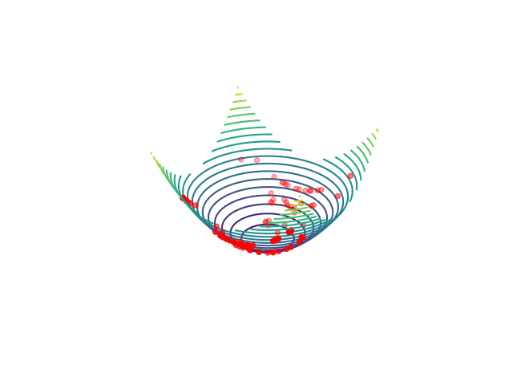

### Exercise 1

##### 1. Do the mutations tend to improve or worsen the fitness of the parent?
-> The mutations tend to worsen the fitness of the parent strictly depending on the dimensionality of the parents and on the mutation magnitude.
##### 2. Are low or high mutation magnitudes best for improving the fitness? How does this depend on the initial value of the parent and on the number of dimensions of the search space?
-> Low mutations seem to be preferrable. If $\sigma$ >> parents' initial values, we get worse fitness. Furthermore, increasing the parents' dimensionality produces similar effects.
In particular we could expect the last result due to curse of dimensionality: high dim => sparse data (high geometrical distance).

Since the objective is getting closer to the minimum, and we know it's in $0$, we should choose $0$ < $\sigma$ < $100$, so that $0$ < d($0$, $\text{offspring}$) < 2d($0$, $\text{parent}$). In the generic case should choose $\sigma$ between the value of the minimum and the parent.

### Exercise 2

The increase in dimensionality is now proven to worsen the fitness. More dimensions equals to more spreading directions, aswell as getting further from the minimum.

### Exercise 3

On the 1-D case we get very close to the optimum (d << $10^{-3}$), but increasing the dimensionality just by 1 we get 0.05 away from it. Running the algorithm for more generations fixes the problem brought by the increase in dimensions as long as $\sigma$ is sufficiently low:

##### Test 1
 - Dim: 20
 - $\sigma$: 1
 - Gen: 2000
 - Distance from optimum -> $\sim$ 2.7

 ##### Test 2
 - Dim: 20
 - $\sigma$: 5
 - Gen: 2000
 - Distance from optimum -> $\sim$ 11.6

 ##### Test 3
 - Dim: 2
 - $\sigma$: 1
 - Gen: 100
 - Distance from optimum -> $\sim$ 0.034

 ##### Test 4
 - Dim: 2
 - $\sigma$: 0.1
 - Gen: 100
 - Distance from optimum -> $\sim$ 0.003

 ##### Test 5
 - Dim: 2
 - $\sigma$: 5
 - Gen: 100
 - Distance from optimum -> $\sim$ 0.36

I believe that having a dynamically changing $\sigma$ would get us to better results. I guess that having a big $\sigma$ at the beginning helps in finding candidate optima, but a small $\sigma$ is better for converging to that optimum. I'd implement a scheduler that updates $\sigma$ based on the distance to the (expected) optimum, choosing at each generation: $\sigma$ = d($\text{optimum}$, $\text{current}$), where optimum is the expected optimum and current is the average over offsprings.

### Exercise 4

Using a small $\sigma$ seems to be generally better, although if it is too small more gens are needed to get a better fitness. In my tests I tried running the script without any modifications (50 Gen, std_dev=[0.01, 0.1, 1]) and the fitness using $\sigma$ = 0.01 was much worse than the parent's. It got much better running 500 generations.

