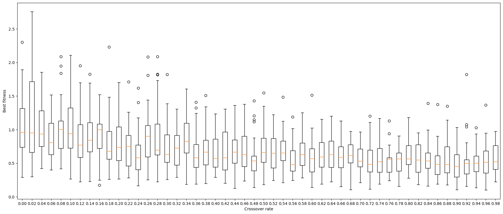
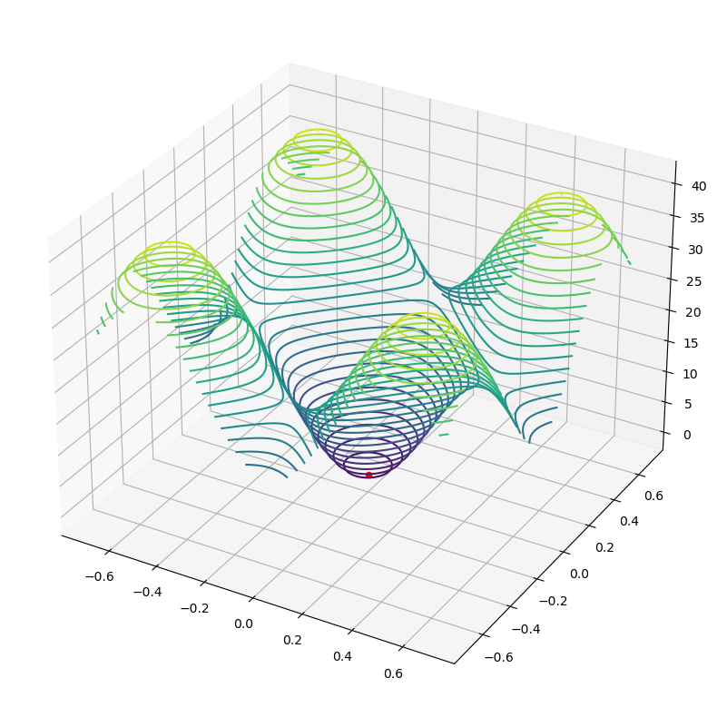

### Exercise 1

Mutation only produces lower fitness, small mutation lead to better convergence.
 - Increasing the range for the initial population by a factor of 10, the fitness increases by the same amount. Increasing it further (without changing $\sigma$) leads to worsen only the fitness obtained by 'crossover only' algorithm.
 - Of course, increasing the $\sigma$ value leads to worse results for mutation fitness ($\sigma$ = 10, r = [-100, 100])
 - Working on higher (>2) dimensional spaces, mutation will be producing higher and higher fitness, while crossover gets better and better, but always worse than mutation only: This is due to the large exploration space.

### Exercise 2

I tried different crossover-rates using np.arange(0, 1, 0.02) to produce the list. The best fit seems to be always around $\sim$[0.5, 0.7], but clearly there is no 'best' crossover rate. Changing the mutation rate gets to similar results, lower (<0.5) m_r produces better average fitness, higher (>0.5) m_r gets higher average fitness.

### Exercise 3

With problem_class = Sphere the only minimum is the global minimum, so using higher selection pressure results in faster convergence to the global optimum. But with problem_class = Rastrigin we search in a space with many local minima, thus a lower tournament size (lower selection pressure) is necessary to find a way to the global minimum. For the exercise, testing on t_sizes = [1.25], we achieve best fitness and distance from the optimum with t_s = 2.

### Exercise 4

After trying on different spaces I focused on the Rastrigin problem. In order to get best fitness, we need to exploit all local minima. To get there we need $\sigma$ < 1. else random mutations will always get the offsprings out of the optimal parabola valley.

