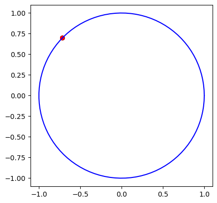

### Exercise 1

 - How do your results change from the unconstrained version (from the previous lab)?

There is higher density of good solutions, also solutions seem to be much closer between each other.

 - Do your previous parameters continue to solve the problem?
 - Try to increase the population size and/or the number of generations to see if you can find better solutions.

I had to increase the population size, wrt. to what I have done in the previous lab, in order to find better solutions. Increasing the number of generations, up to 1000 did not result in significant improvements. Solutions are less sparse and the amount of individuals that share good fitness for objectives is much higher.

### Exercise 2

 - Do you see any difference in the GA's behavior (and results) when the penalty is enabled or disabled?

Having constraints does not prohibit the use of genetic algorithms, moreover, using a penalty system seems to poduce better results.

 - Try to modify the penalty functions used in the code of each benchmark function (check the code corresponding to `if usePenalty`, and/or change the main parameters of the GA `max_generations`, `pop_size`, `gaussian_stdev`, `mutation_rate`, `tournament_size`, `num_elites`) in *Exercise 2*. Are you able to find the optimum on all the benchmark functions you tested?

In this exercise I changed many times the parameters, and still was not able to find a combination of them that could exploit the best optima for all problems. In particular, on the Townsend problem no matter how many times I tried running the algorithm, the individuals could not escape from local minima close to the best solution.

 - Is the GA able to find the optimal solution lying on the unit circle? If not, try to change some of the GA's parameters to reach the optimum.

Yes, as you can see in the picture below, the individual converged together to the same solution lying on the unit circle.

 - By default, the sphere function is defined in a domain $[-5.12,5.12]$ along each dimension. Try to increase the search space (to do so, change  `self.bounder` and `generator` in the class `SphereCircle`. To progressively increasing boundaries (e.g. $[-10,10]$, $[-20,20]$, etc.). Is the GA still able to explore the feasible region and find the optimum?

Yes, but it takes more generations to make all individuals converge to that solution.

 - Try to modify the sphere function problem by adding one or more linear/non-linear constraints, and analyze how the optimum changes depending on the presence of constraints.

I tried to find a solution on the circle $x^2 + y^2 = 10$ and on the line $y = 3x + 5$ and notwithstanding the two constraints the algorithm finds feasible solutions, accordingly to the constraints I am writing.

 - What do you think is the most efficient way to handle constraints in EAs?

I believe that the penalty function method is the most efficient one, because the penalty function can be designed to impose a significant penalty on infeasible solutions, discouraging the algorithm from converging towards them.

- Do you think that the presence of constraints makes the search *always* more difficult? Can you think of cases in which the constraints could actually make the search easier?

 Constraints restrict the search space, and finding feasible solutions that satisfy all constraints can be difficult, especially when the constraints are complex or conflicting. Nonetheless, constraints may help in simplifying the problem by reducing the number of possible solutions, defining a more focused problem. Also, thinking to the Rastrigin problem that was previously presented in a lab, constraints may guide the individuals to the right solution, discarding solutions that are far from the optimum.