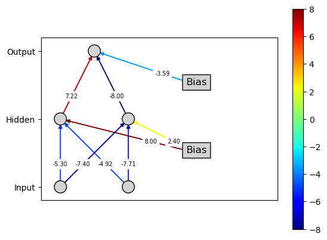
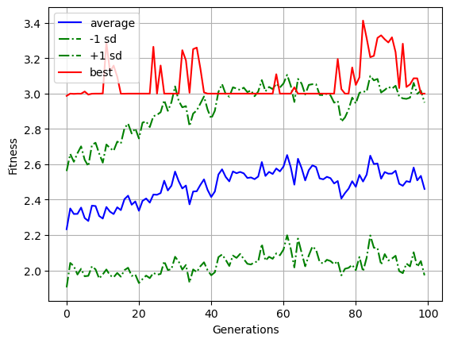
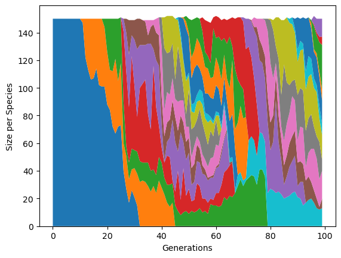
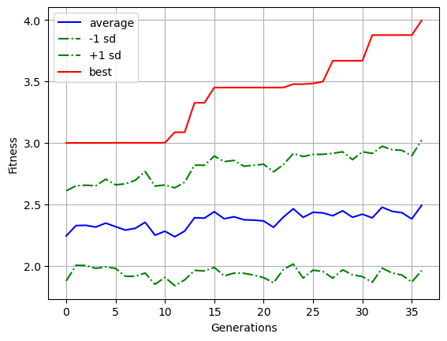
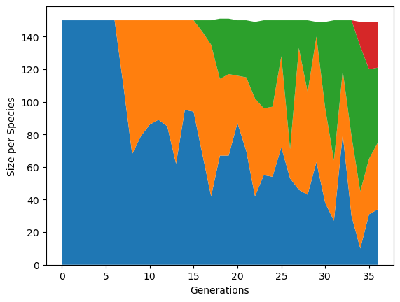
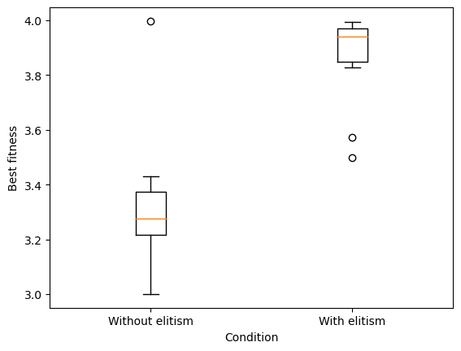

### Exercise 1

##### - Try running the code again after changing ``problem_class`` to ``Xor``. Can you solve it? If you are unable to solve it, why is that?

No (fitness $\approx$ 1), because it is a non linearly-separable problem

##### - In this case, it is worth considering an additional parameter that can be tuned, that is the number of hidden nodes of the Neural Network (parameter ``args["num_hidden_units"]``. Try changing this parameter from 0 to 1 (this will add to the topology a hidden layer with one node).
- Does this allow you to solve the problem? What if you change this value to 2 or more?
- How many hidden nodes are required to solve this problem? Can you provide an explanation for why that is the case?

In order to solve the problem a minimum amount of 2 hidden layers is required, by separating the problem space we obtain at least 2 different regions, for each region a hidden node

### Exercise 2

#####  - Run the jupyter block code to solve ``Temporal Or``. Can you solve it? If you are unable to solve it, why is that?

No, the reason for that is that you need to exploit the temporal dependency of the inputs, in particular without using a RNN the output depends only on the current input, but to solve the ``Temporal Or`` problem you also need memory of previous inputs

##### - Do the same EA parameters that solved ``Temporal Or`` also work for ``Temporal And``? Why, or why not?

Yes, because the problems are 'structurally' the same

##### - Finally, change in the script the parameter ``problem_class`` to ``TemporalXor``, to attempt solving a temporal version of ``Xor``. Run the code again.
- Are you able to find a successful network?
- If not, think back to what you just saw in the previous exercise. What combination of recurrence and no. of hidden nodes is needed to solve ``Temporal Xor`` and why is that?

As in the previous exercise, 2 hidden nodes makes the problem solvable

### Exercise 3

##### - First, run a single instance of each of the two configurations (with/without elitism, simply change ``config_files[0]`` to ``config_files[1]``). What do you observe? Is the algorithm without elitism able to converge to the optimal fitness value? What about the algorithm with elitism? What is the effect of elitism on convergence? What about the number of species and their dynamics?

Without elitism the algorithm is unable to converge to the optimal fitness, as you can see in the picture below. Species are increasingly diversified as we get to later generations.

| No elitisism |
| -  - |
| |  |

Without elitism the algorithm is unable to converge to the optimal fitness, as you can see in the picture below. Species are increasingly diversified as we get to later generations.

| No elitism fitness | Speciation |
| - | - |
| |  |

On the other hand with elitism the best results converge to the optimal value and the number of species is significantly lower. About convergence we can say that it seems to improve results with the generations.

| Elitism fitness | Speciation |
| - | - |
| |  |

##### Change the parameter ``num_runs`` to $10$ or more. Does the boxplot confirm -in statistical terms- what you observed on a single run? (**NOTE**: it takes 1-2 minutes to execute 10 runs for both configurations.)

Running the algorithm for 10 runs confirms what I said earlier. Results below:

