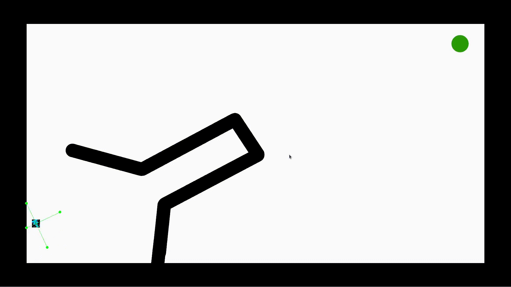

### Exercise 1

 - Is the Evolutionary Algorithm able to evolve a Neural Network controller that can reach the target? What kind of motion strategy does it use?
 
Yes, using 5 hidden nodes on one hidden layer it is able to reach the target simply lining up with the target and proceeding in a line.
 
 - What is the minimum-complexity Neural Network controller that you can think of? Hint: think about the necessity of using all the available sensor inputs in this case, and if any of them can be discarded (see the configuration dictionary to disable inputs). Also, consider reducing the no. if hidden nodes and test different network configurations to identify the simplest controller.
 - By looking at the weights of the best evolved Neural Network in the simplest case you just found, can you try to make sense of the controller functioning? (Note that weights appear ordered by layer and, for each layer, by node.)

Without hidden layers the NN controller is unable to reach the target and makes the car crash on walls. It is reasonable to use 5 hidden nodes as the 5 sensors of the car. 

### Exercise 2

 - Take the best Neural Network evolved in the previous exercise and run it in the new scenario, running the next cell.
 - What happens in this case? Is the best Neural Network evolved in the previous exercise able to generalize to this new environment? Why?

The car crashed and stucks into a wall. No matter how I tweaked the parameters (increased generations) or change the fitness function, in a white map the EA is unable to evolve the controller to generalize and make it reach the target in the harder scenario.

Running the EA on the harder map produced different results: the car now tries to proceed linearly towards the target, but then crashes into a wall and remains still. I tried using different fitness functions, but with most of them I wasn't able to escape the walls.

```python
fitness = 2 * distanceToTarget + pathLength - 3 * noOfTimestepsWithCollisions - 0.5 * timestepToReachTarget
```

This is the final fitness I decided to use, and it was able to get to the target with a reasonable path only after 369 generations with pop_size = 100 (The algorithm ran for $\sim$ 45 minutes).



- What do you think it could change between a simulated and a real-world experiment in the case of a maze navigation task?

There could be some issues due to light, sensors malfunctionings, etc. In this specific scenario, 2-D simulations are much different from 3-D, as sensor may move, and the approximation of the car to a rectangle might not be sufficient.

- Can you think of some possible applications where a maze navigation robot task could be used? Why would it make sense to use Swarm/Evolutionary Robotics in those cases?

I believe such systems are made for Inventory Management in Amazon, in which swarm cooperation is crucial. Another good application might be found in Roombas for home cleaning, or in a defintely harder scenario, autonomous driving.