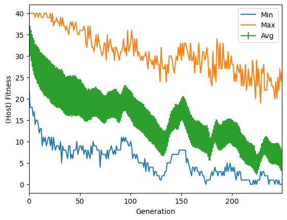

### Exercise 1

 - Try out different parameter combinations of numOpponents, archiveType, archiveUpdate, and updateBothArchives, and observe what kind of robot behavior is evolved. Can you find cases where the prey "wins"? Can you find cases where the predator "wins"?

At first I tried with the default parameters (1 opponent) and the prey was "winning", but because the prey was not actually hunting, but staying on the spot. So I tried to increase the number of opponents to 5 and now the predator was slowly getting to the prey. Then I tried to change archiveUpdate to "WORST" and archiveType to "BEST" but this time the predator stuck itself into a wall.

Using "archiveType": "HALLOFFAME", "archiveUpdate": "AVERAGE" the predator was effectively able to catch the prey. Setting "updateBothArchives": False did not change anything in the results.

NOTE: The prey was always stuck on a wall.

 - Try to change the fitness formulation and observe what kind of behavior is evolved. Remember to change the two flags problemPreysMaximize and problemPredatorsMaximize properly, according to the way you defined the fitness function.

I modified the fitness functions, so that the prey's is to maximize and the one of the predator is to minimize:

```python
def fitness_eval_prey(finalDistanceToTarget, avgDistanceToTarget, minDistanceToTarget, maxDistanceToTarget, timeToContact):
    fitness = 2*finalDistanceToTarget + 3*timeToContact + 2*minDistanceToTarget
    return fitness

def fitness_eval_predator(finalDistanceToTarget, avgDistanceToTarget, minDistanceToTarget, maxDistanceToTarget, timeToContact):
    fitness = 2*finalDistanceToTarget - 3*timeToContact + 2*maxDistanceToTarget
    return fitness
```

But it was not properly working, so I tried:

```python
def fitness_eval_prey(finalDistanceToTarget, avgDistanceToTarget, minDistanceToTarget, maxDistanceToTarget, timeToContact):
    fitness = 2*finalDistanceToTarget + 2*minDistanceToTarget
    return fitness

def fitness_eval_predator(finalDistanceToTarget, avgDistanceToTarget, minDistanceToTarget, maxDistanceToTarget, timeToContact):
    fitness = 2*finalDistanceToTarget - 3*timeToContact
    return fitness
```

The predator got better, but the prey is still unable to escape, probably a higher number of generations is needed.

### Exercise 2

 - Is the co-evolutionary algorithm able to evolve an optimal (without sorting errors) SN, in the default configuration?

Yes, during the whole algorithm run it only had 2 sorting errors.

 - Try to investigate this problem in different configurations. In particular, focus on the effect of the size of the input sequences (`INPUTS`), the number of input sequences per parasite (`P_NUM_SEQ`), and the two population sizes (`POP_SIZE_HOSTS` and` POP_SIZE_PARASITES`). If needed, also change the size of the Hall-of-Fame (`HOF_SIZE`) and the number of generations  (`MAXGEN`). What conclusions can you draw? For instance: What makes the problem harder? What is the effect of `P_NUM_SEQ`? What can you do to solve the harder problem instances?

By increasing INPUTS to 10 the total sorting errors are 513, and the algorihtm is unable to find an optimal solution. Increasing the number of input sequences per parasite (`P_NUM_SEQ`), makes the problem harder and the number of errors increases with it. Increasing the two population sizes reduces errors.

I tried to solve the problem with INPUTS: 10, P_NUM_SEQ: 40. I used this configuration to find an optimal solution:

```python
config = { "INPUTS": 10,        # length of the input sequence to sort
"POP_SIZE_HOSTS" : 2000,        # population size for hsots
"POP_SIZE_PARASITES" : 2000,    # population size for parasites
"HOF_SIZE" : 3,                # size of the Hall-of-Fame
"MAXGEN" : 250,                 # number of generations
"H_CXPB" : 0.5,                # crossover probability for hosts
"H_MUTPB" : 0.3,               # mutation probability for hosts
"P_CXPB":0.5,                  # crossover probability for parasites
"P_MUTPB" : 0.3,               # mutation probability for parasites
"H_TRNMT_SIZE" : 3,            # tournament size for hosts
"P_TRNMT_SIZE" : 3,            # tournament size for parasites
"P_NUM_SEQ" : 40               # number of shuffled sequences for each parasite
}
```



- Can you provide some example applications where you think a competitive co-evolution approach could be used?

The most interesting application I can think of is cybersecurity, with the defender and attacker scenario. But there are also traffic optimization, or games.

- Can you think of some other competitive co-evolutionary dynamics in nature different from the prey-predator case?

I believe that such mechanism is involved in social interactions: competitive co-evolutionary dynamics can also be observed in social systems, such as human societies or animal groups. Individuals compete for resources, or status, leading to the emergence of complex social behaviors and strategies.