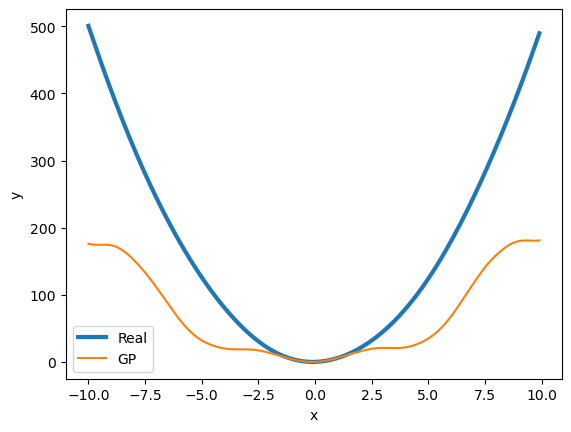

### Exercise 1

- Is the GP algorithm able to approximate the given polynomial, with the standard configuration? What happens when you run the script multiple times? Do you always obtain the same results, or not? Why?

Yes, the approximation is indistinguishible from the real function in the graph using the standard configuration. Running the script multiple times (setting the seed to random) never gets the same results, because of how the solution space is explored, it is very difficult to get 2 times the same solution.
    
- Try to change the generator function (e.g. to include trigonometric functions) defined in the method `generatorFunction`. Is the GP algorithm able to approximate more complicated generator functions? Which parameters can you change to improve the results?

I used:

```python
def generatorFunction(x):
    return math.sin(x)+5*x**2
```

And still works as previously. I tried by decreasing the GP_POP_SIZE (<50) and it was unable to find the optimal solution.

By runnning many times, only once it produced wrong results:



### Exercise 2

I tried to run all 4 problems, by tweaking the parameters it is possible to achieve better fitnesses even without increasing the number of total evaluations.

 - What are the main strengths and limitations of GP, in your opinion?

I believe that GP's strengths lie in its interpretability and automatic feature engineering, but sometimes they might be too expensive or produce overly complex solutions due to the fact that usually data is not distributed like simple trigonometric/polynomial functions, and their approximations might be not so simple.
 
 - In which kind of applications do you think that GP could be more useful than other kinds of black-box Machine Learning techniques, such as Neural Network? Why?

Symbolic regression is much more interpretable, but to me the main difference is in feature engineering. Deep learning technique expecially exploit feature engineering by creating deep representations of data in the latent space, that are completely not-readable by humans. On the other hand GP makes feature engineering automatic (not manual as in standard ML) but still comprehensible.