### Exercise 1

 - What kind of considerations can you make regarding the fitness trend (Is the algorithm able to converge to a reasonably low fitness function? How quick is the convergence?), and the activity grid (For instance, are there regions of the feature space that are visited/updated more frequently than others?). What kind of illumination pattern do you observe? Do you see any trend/correlation between performance and features of the map?
    
 - Try to change the parameters of the MAP-Elites algorithm, i.e.,: `NO_BINS`, `MAX_ITEMS_BIN`, `BUDGET`, `BATCH_SIZE`, which indicate, respectively, the number of bins (that is the same for both features), the maximum number of items stored in each bin of the grid, the total budget of the evolutionary process (number of function evaluations), and the batch size, i.e., how many solutions are evaluated at each iteration of MAP-Elites. Focus in particular on `NO_BINS`. What is the effect on the fitness trend and the performance map when you increase or decrease the number of bins?
    
 - Try to change the problem dimension (`PROBLEM_DIM`) to a much larger value, for instance 10 (remember that Rastrigin is a scalable benchmark problem, meaning that it can be defined for any number of variables). Note that in any case the first two variables are taken as features for MAP-Elites. What kind of considerations can you make in this case regarding the illumination pattern and the other aspects (i.e., the fitness trend and the activity grid) of the results? Does illumination become more difficult (i.e., less bins are visited, with poorer performance)? Why?

By increasing the number of bins the space gets less and less explored, hence higher budget of evolutionary process is necessary.

##### Budget: 10k

|No.Bins: 32|No.Bins: 64|No.Bins: 128|
|---|---|---|
|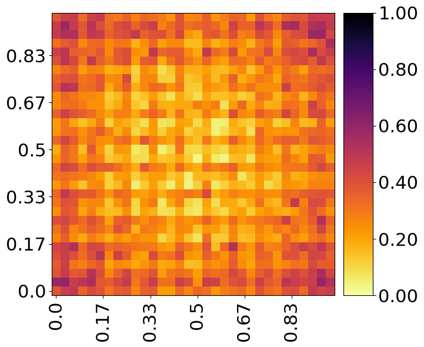|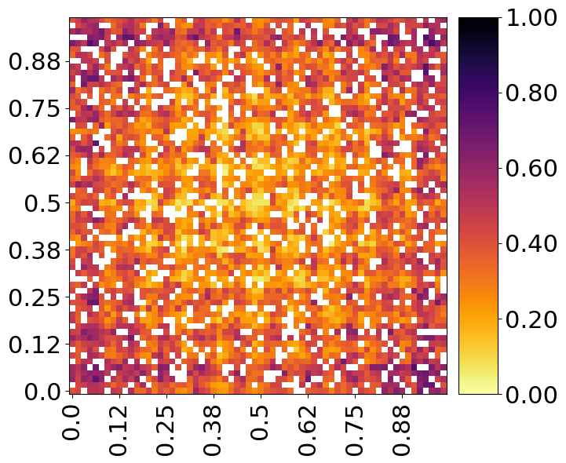|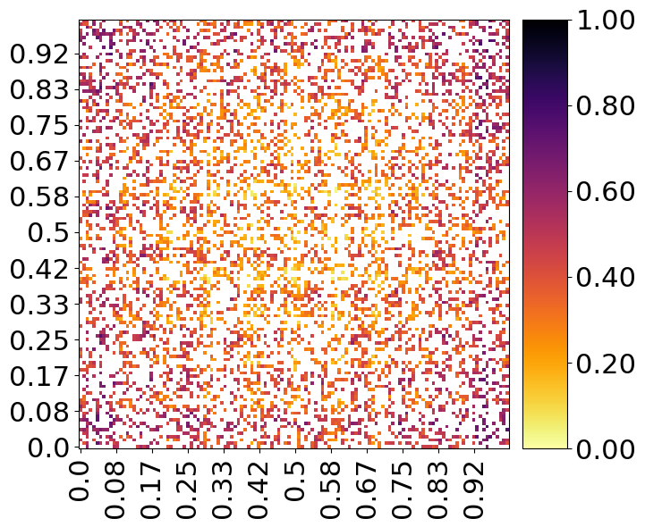|

Nevertheless, increasing the budget will lead to better exploration results:

##### Budget: 100k

|No.Bins: 32|No.Bins: 64|No.Bins: 128|
|---|---|---|
|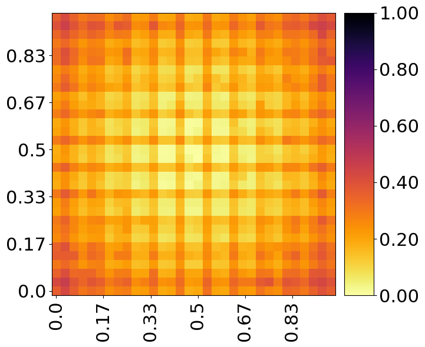|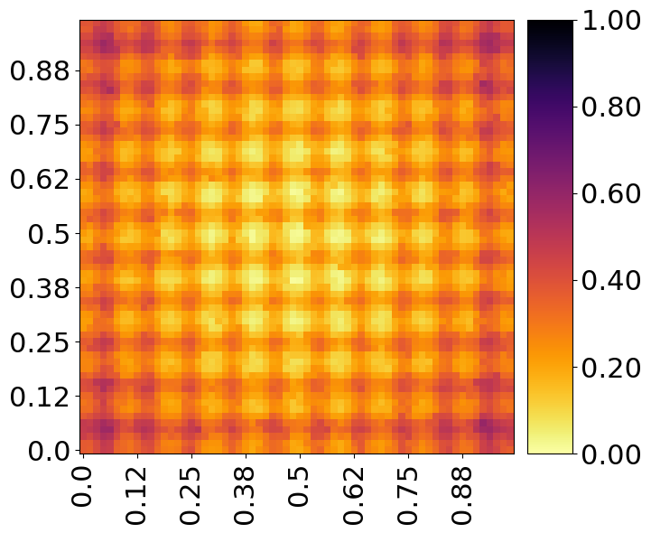|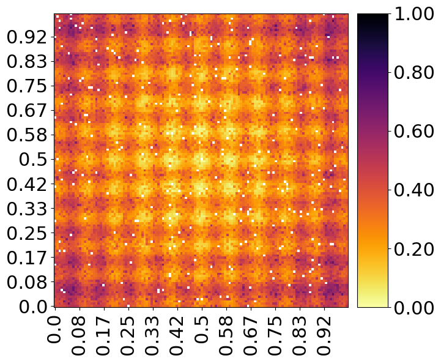|


Increasing the dimensionality makes the problem much harder, in particular we get higher both average and minimum fitness. Convergence is achieved after an higher number of evalutation.

|No.Bins: 128, Budget: 100k, Dimensions: 10|Evaluation function|
|---|---|
|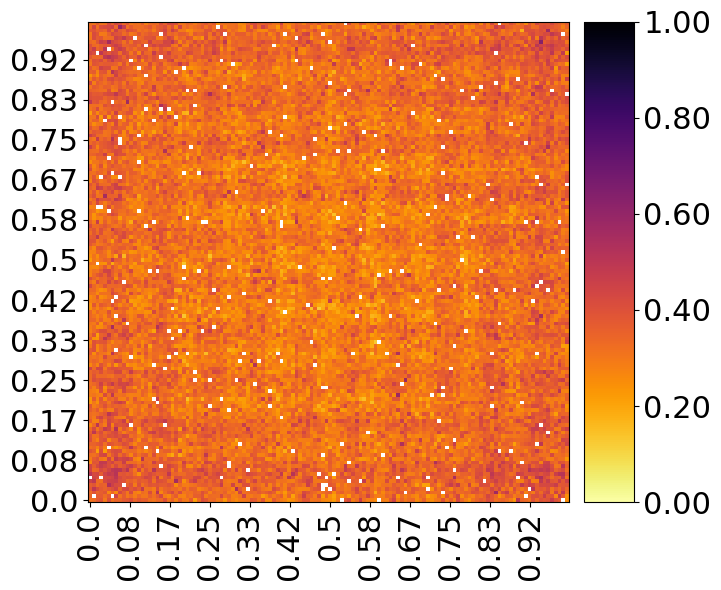|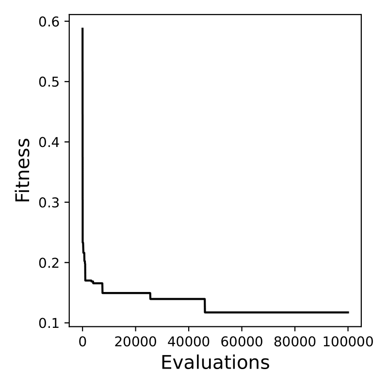|

### Exercise 2

 - What kind of considerations can you make in this case regarding the fitness trend and illumination pattern?
 
 -  Also in this case, try to change `NO_BINS` and `PROBLEM_DIM`, and see if you can confirm the observations made in the previous experiment.
 
 - If you want, you could try to change the custom function definition in `eval_fn` and replicate the experiment with a different setting. What kind of results do you obtain?

As in the previous exercise, increasing the number of bins the space gets less explored, hence a higher budget is again necessary. About the illumination pattern and the activity grid, I noticed that zones closer to candidate optima where updated less frequently, or at least this event was frequent in my experiments.

|No.Bins: 32, Budget: 10k, Dimensions: 3|Activity grid|
|---|---|
|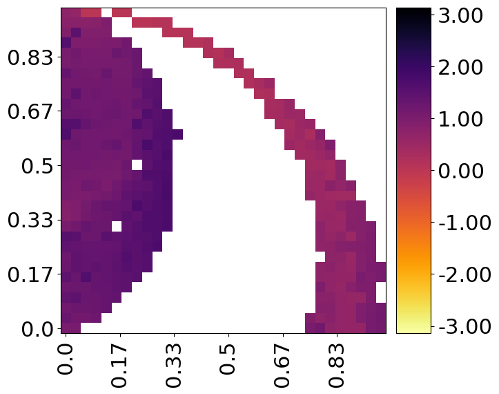|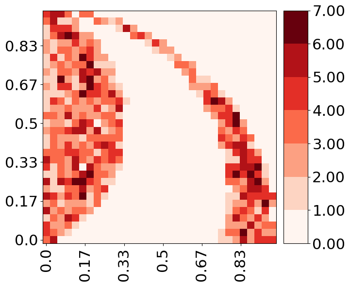|

Changing the `eval_fn` we get similar results:

```python
def eval_fn(ind):
    """An example evaluation function. It takes an individual as input, and returns the pair ``(fitness, features)``, where ``fitness`` and ``features`` are sequences of scores."""
    normalization = sum((x for x in ind))
    k = 10.
    score = 1. - sum(( math.cos(k * ind[i]) * math.exp(-(ind[i]*ind[i])/2.) for i in range(len(ind)))) / float(len(ind))
    fit0 = sum((x * math.sin(abs(x) * 0.5 * math.pi) for x in ind)) / normalization
    fit1 = sum((x * math.cos(abs(x) * 3. * math.pi) for x in ind)) / normalization
    features = (fit0, fit1)
    return (score,), features
```

|No.Bins: 32, Budget: 10k, Dimensions: 3|Activity grid|
|---|---|
|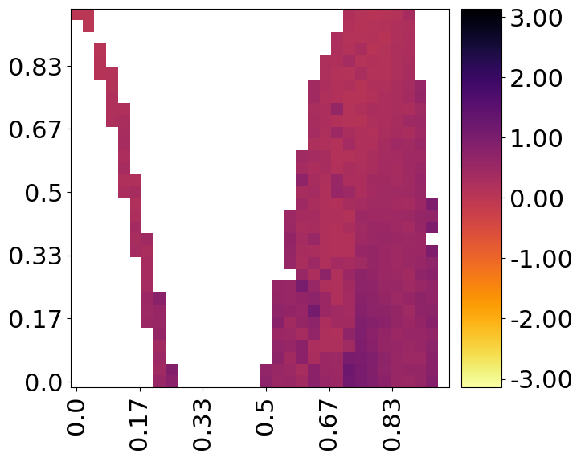|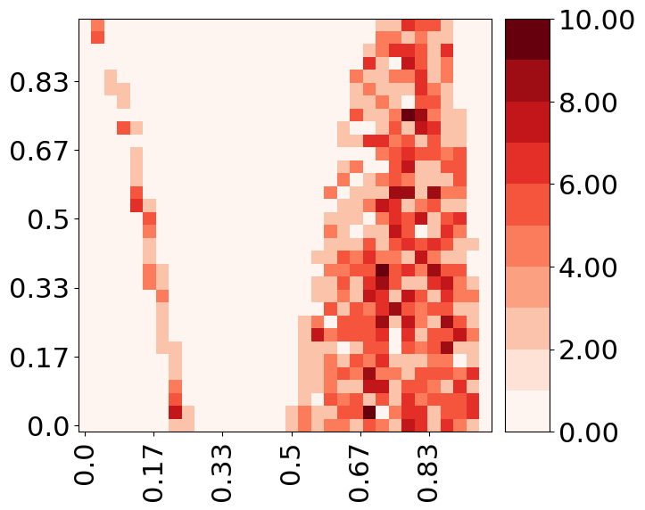|

### Exercise 3

 - Is the algorithm able to approximate the given polynomial?

Yes, even if not clearly visible from the performanceGrid. I tried running the GP for more generations and the results were very similar.

 - Do you think there is a trade-off between quality and diversity, or one aspect is more important than the other? If so, which one, and in which circumstances?

Definetely, for exploration diversity may be more important than quality as the goal is to discover different regions of the search space that contain potential high-quality solutions. On the other hand, quality becomes more important for exploitation as the goal is to find the best solutions within those promising regions found during exploration. Finding a good trade-off might be particularly useful in multi-modal problems, where it is easy to stuck in local minima.
 
 - In which kind of applications do you think that MAP-Elites (and quality-diversity algorithms in general) could be useful? Why?

I believe MAP-Elites might be useful in multi-objective optimization problems, MAP-Elites should be able to identify a diverse set of solutions that represent different trade-offs between conflicting objectives. Probably it found great application in autonomous systems, where it is crucial to analyze a wide range of solutions and choose the best one.