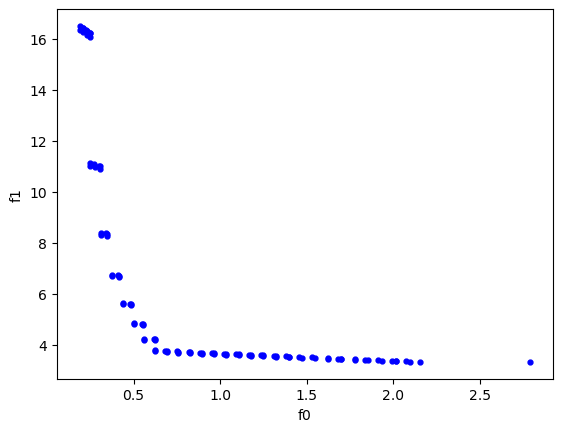

### Exercise 1

 - What happens when you run the GA with this fitness function?
 - Why do you obtain this result? (Hint: pay attention to the relative scaling of the two objectives!)

We get a negative fitness and the final population is halfway between the best solutions for the two problems, this happens becomes the weights assigned to each problem are the same (0.5, 0.5).

 - What happens if you give the first (or second) objective all of the weight?

The final population converges to the best solution for the first (or sencond) problem.

 - Can you think of a method for combining the objectives that might work better than using a weighted sum? (NOTE: If you want to try your idea out, edit the `init` method of `CombinedObjectives`).

In some rare situations it might be good to just take the best result. I imagine this in a situation in which we are able to choose what problem is the one we want to solve.

### Exercise 2

 - How do the solutions you find here compare to those found in exercise 1?

In here the final popularion is clearly split in 2 different distributions, both trying to get to the minimun of a different problem. In exercise 1 we had only one mode.

 - Is there a single solution that is clearly the best?

As is logically deducible by my previous response, there is no "absolutely best" solution.

 - Can you still find good solutions?

It is much more difficult to find good solutions, as expected by the increase in objectives and dimensionality.

 - What happens if you increase the population size (change the variable `args[pop_size]` in the script) or the number of generations (see the parameter `args[max_generations]`?

Even by increasing by a lot (1000+) the number of generations or the population size, the final population is distributed in a much similar fashion.

### Exercise 3

 - Is the algorithm able to find reasonable solutions to this problem? Use what you have learned about population sizes and number of generations to improve the quality of the found solutions. (NOTE: Do not make them too big or you will have to wait a long time to obtain results!)

Yes, ($\sim$ 4kg, $\sim$ 0.6 s) seems to be the best tradeoff.

 - Do you see any patterns in the Pareto-optimal solutions that may help you in designing a well-performing disk-brake in the future?

Probably the fact that the weight of the brake systems increases exponentially as the stopping time lowers.

 - In biological evolution it is possible to think of many phenotypic traits that contribute to the ultimate fitness of an organism (try to enumerate some of these). What (if any) relevance do multi-objective evolutionary algorithms have to biology?

Some phenotypic traits are: body size, coloration, metabolism, camouflage patterns on animals, etc., but also behavioural patterns. In biology multi-objective evolutionary algorithms are useful in drug discovery, since it is necessary to optimize multiple drug properties simultaneously, such as efficacy, safety, solubility, tollerability... . Of course drug discovery is only one of a numerous set of applications.