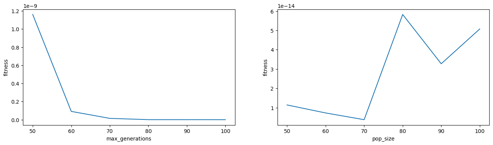

### Exercise 1

##### - What is the effect of each behavior coefficient?

 - Cohesion: Boids fly towards the same center, the higher the value, the faster they get to the center
 - Aligment: Boids align with their neighbors by sharing their velocity
 - Separations: boids' separation from neighbors

##### - Which combination of coefficients leads to the most ``natural'' flock behavior? 

A good combination of parameters to achieve natural flock behavior is:

 - Cohesion: 1.0
 - Alignment: 1.0
 - Separation: 0.2

In this way the boids of the swarm fly together keeping more or less the same velocity.

### Exercise 3

 -  What kind of behavior does PSO have on different benchmark functions (change the parameter `args["problem_class"]` to try at least a couple of functions), in comparison with the EAs? Does it show better or worse results? Does it converge faster or not?

I wrote a python function 'run_pso', that runs both EAs and the PSO and prints the fitness functions. I ran this:

```python
problem_classes = [
    benchmarks.Sphere,
    benchmarks.Rosenbrock,
    benchmarks.Griewank,
    benchmarks.Ackley,
    benchmarks.Rastrigin,
    benchmarks.Schwefel]

for p in problem_classes:
    run_pso(p=p, gen=100, pop=100, top=pso.RING)
```

and the EAs consistently produced better results and had faster convergence.

 - What happens if you run the script multiple times? Do the various algorithms (and especially PSO) show consistent behavior?

By running the script multiple times I noticed that the behavior of PSO was the least consistent.

 - Increase the problem dimensionality (`num_vars`, by default set to 2), e.g. to 10 or more. What do you observe in this case?

I ran this code:

```python
dims = [
    2,
    3,
    4,
    5,
    10,
    20,
    50,
    100
]

for dim in dims:
    run_pso(dim=dim, p=benchmarks.Sphere, gen=100, pop=100, top=pso.RING)
```

I noticed that below the 10 dimensions the best fitness value of GA, ES and PSO were not so distant from each other, but scaling up the difficulty of the problem PSO produces much worse results.

| Dimensions | GA           | ES            | PSO           |
|------------|--------------|---------------|---------------|
| $2$          | $2.86*10^{-5}$ | $4.51*10^{-14}$ | $3.59*10^{-13}$ |
| $10$         | $0.33$         | $0.02$          | $0.02$          |
| $100$        | $83.44$        | $343.67$        | $478.77$        |

 -  Change the population size (by changing `args["pop_size"]`, by default set to 50) and the number of generations (by changing `args["max_generations"]`, by default set to 100), such that their product is fixed (e.g. $50 \times 100$, $100 \times 100$, etc.). Try two or three different combinations and observe the behavior of the three different algorithms. What do you observe in this case? Is it better to have smaller/larger populations or a smaller/larger number of generations? Why?

I ran this code, taking best individuals from PSO:

```python
import numpy as np

gens = np.arange(50, 110, 10)
pops = gens

gen_results = []
pop_results = []

for p, g in zip(pops, gens):
    best_gen, gen, _ = run_pso(gen=g, pop=100)
    gen_results.append(best_gen)
    best_pop, _, pop = run_pso(gen=100, pop=p)
    pop_results.append(best_pop)
```

and I got these results:



so it is better to have a smaller population and larger number of generations. The reason is probably that PSO needs more generations (more computation) to converge to good solutions dependently on the population size.

- When do you think it is useful to have a lower (higher) cognitive learning rate? What about the social learning rate?

I believe that low cognitive learning rate (CLR) is useful in stable environments where prior knowledge is reliable, conversely high CLR is necessary in conditions where the individuals need to adapt and explore a lot the solution space. On the other hand lower social learning rate (SLR) makes the individuals search solutions relying more on their own knowledge, so it is good for local exploration, expecially when external information is uncertain. High SLR instead promotes collaboration between individuals granting the ability to find better and better solutions by sharing knowledge.

- From a biological point of view, which neighborhood topology do you consider as the most plausible?

In my opinion topologies such as the ring are the most plausible ones, where individuals are conditioned only by the neighbors. I believe that this is true in biology because of what happens in the brain, neurons that fire together, wire together, so local conditioning is present in nature. Even in neural networks, the closer a neuron is to another neuron, the more it gets affected by the other's activation.