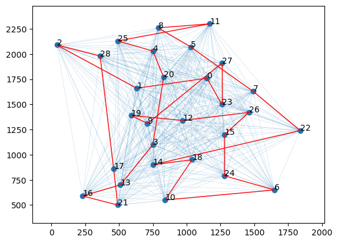
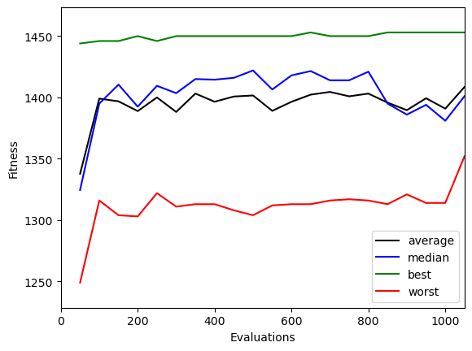
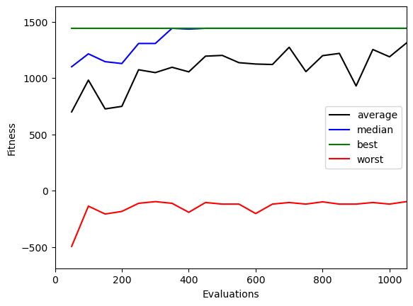
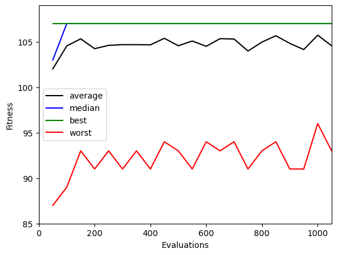
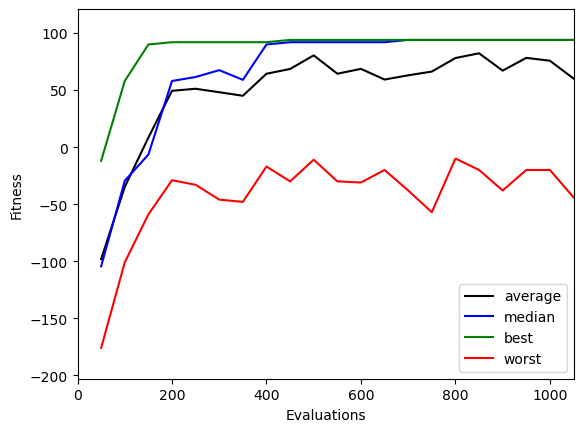

### Exercise 1 (TSP)

##### - Which algorithm provides the best solution in most cases? 

The ACS seems to produce consistently better results in terms of distance of the path. Also, with a number of generations of 20 the EA is unable to find a closed path, increasing them (e.g. to 200) fixes this, but the ACO still has better average fitness.

#### p01 - min_len: 291
(20 gens)
 - ACS = 291
 - EA = 381
 
(100 gens)
 - ACS = 291
 - EA = 291

#### bays29 - min_len: 2020
(20 gens)
 - ACS = 2578
 - EA = 3146
 
(100 gens)
 - ACS = 2384
 - EA = 2396

| ACS (100 gens) | EA (100 gens) |
|--------------|--------------|
|  |  |

#### ATT48 - min_len: 33523
(20 gens)
 - ACS = 50590
 - EA = 96380
 
(100 gens)
 - ACS = 48560
 - EA = 54391

##### - What can you say about the number of function evaluations needed to converge?

We can say that ACS needs a considerably smaller number of evaluations for convergence with respect to EA, that in some cases doesn't actually achieve that

### Exercise 2 (Knapsack problem)

##### - Which algorithm provides the best solution in most cases?

The algorithms provide very similar results in terms of best fitnesses, but on average fitness ACS is always better and never breaks constraints (fitness < 0). You can see the example of istance #07 below:

| ACS | EA |
|--------------|--------------|
|  |  |

##### - What can you say about the number of function evaluations needed to converge?

Even in this case, ACS achieves faster convergence

### Exercise 3 (Knapsack with duplicates)

##### - Which algorithm provides the best solution in most cases?

In the case of Knapsack problem with duplicates ACS gives better and better performances as the number of variables increases with respect to the EA. In particular, sometimes the EA is unable to find a good solution, returning negative fitness.

| ACS | EA |
|--------------|--------------|
|  |  |

##### - What can you say about the number of function evaluations needed to converge?

Even in this problem, ACS achieves performance in just a few evaluations. On the other hand, EA sometimes doesn't converge (20 gens), and when it does, it does slowly. The differences with respect to previous problem, is in the overall behavior of the population. The worst fitnesses get better and better, and are less irregular using both algorithms.

##### - What are the main differences between continuous and discrete optimization problems? Do you think that any of these two classes of problems is more difficult than the other?

In discrete optimization problems we can keep in memory constraints, and we can consider them at any time for the decision of the next node (looking at the solution space as a graph). In the continuous case we just decide a direction in which to move and we penalize wrong decisions a posteriori.

I'd say that discrete optimization is overall easier to perform.

##### - Why is ACS particularly suited for discrete optimization?

ACS has memory of constraints, so we do not need to penalize the model, since it will never break constraints in a discrete domain. EA on the other hand gets penalized when the algorithm chooses a solution that breaks constarints

##### - Consider the two versions of the Knapsack problem (0/1, and with duplicates). Which of the two problems is more challenging from an optimization point of view? Why?

The problem with duplicates is indeed more challenging for optimization. The reason for that is simply having a bigger solution space.
